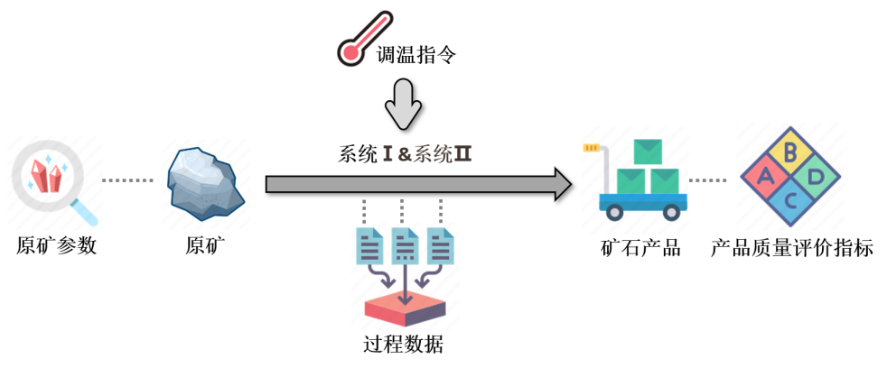
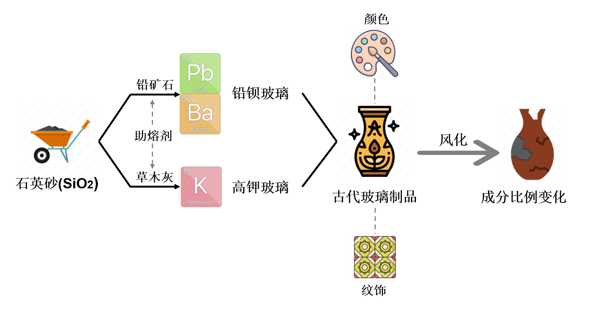
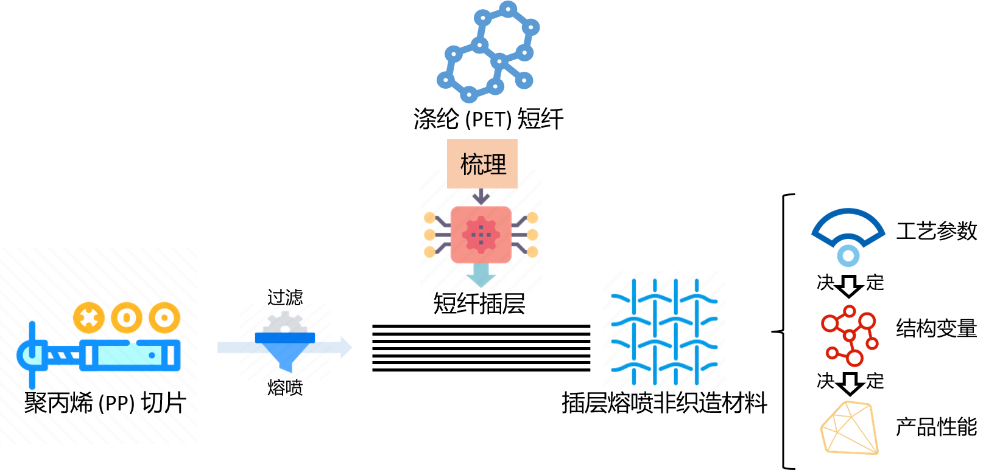
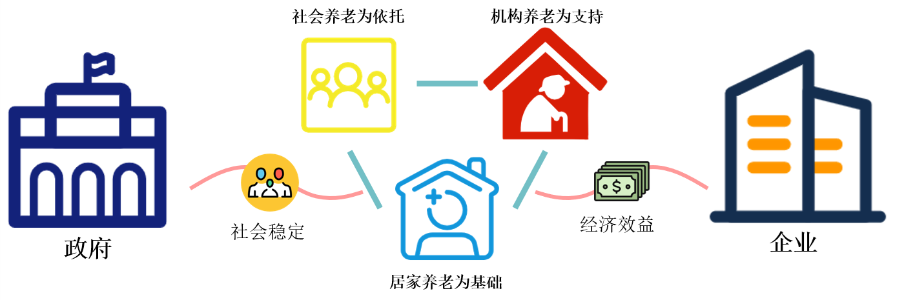
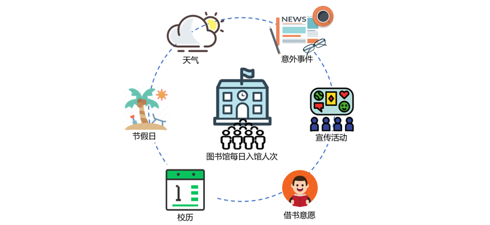
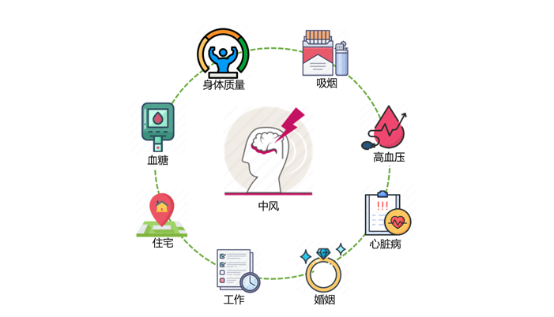

# 数模论文集 (Math-Model-Papers)

  

Welcome to the paper and code repository of the Wuhan University of Technology Math Modeling Team (YuJie Wang, YueYi Zhang, YiMing Yang). In this project, we have collected our excellent works in mathematical modeling competitions and some research papers we wrote during training. Here is the [***content***](#Math-Model-Papers).

欢迎来到武汉理工大学数模团队（王与杰、张悦毅、杨一鸣）的论文及相关代码仓库。在这个项目中，我们汇集了我们在数学建模竞赛中的优秀作品以及我们在训练过程中撰写的一些研究论文。这里是[***内容***](#数模论文集)。

# Math-Model-Papers

## Table of Contents

- [Project Introduction](#project-introduction)
- [Paper List](#paper-list)
- [Team Experience](#team-experience)
- [Contact Us](#contact-us)

## Project Introduction

This repository collects our papers from the Wuhan University of Technology Summer Camp Training Competition and national competitions. Our papers mainly focus on the field of data mining, covering data processing, evaluation indicators, machine learning, neural networks, and intelligent algorithms. Our goal is to provide practical experience and inspiration for mathematical modeling enthusiasts by sharing these papers and codes, and to promote research and development in related fields. We also hope to establish contact with more mathematical modeling enthusiasts and experts for joint discussion and learning.

In this project, you can find:

- Our award-winning papers and related codes in mathematical modeling competitions
- Research papers we wrote during training, covering problem-solving solutions in multiple fields
- Team experience and honors, demonstrating our achievements and progress in the field of mathematical modeling

## Paper List

### ** Note: Each paper contains the following content **
- Abstract

- Question recap

- Model hypothesis

- Symbol Description

- Model establishment and solution

- Model evaluation

- References

- Appendix with key data and code

1. **Classification and Identification Analysis of Ancient Glass Composition - National Mathematical Modeling Competition Second Prize Winning Paper**
   - [PDF](Papers/古代玻璃制品的成分分类与鉴别分析_数模国赛二等奖获奖论文.pdf)
   - [CODE](code)
   - *Keywords: benchmarking matching strategy, partial least squares regression, k-means ++, XGBoost, gray correlation quantization*

2. **Oil Investment Strategy Based on ARIMA-LSTM and Return-Risk Planning Model**
   - [PDF](Papers/基于&#32;ARIMA-LSTM&#32;和收益-风险规划模型的石油投资策略.pdf)
   - *Keywords: Armi-LSTM, Markov chain, risk factor, grey relational evaluation model *

3. **Ore Processing Quality Problem Based on XGBoost Prediction Model and Empire Competition Algorithm **
   - [PDF](Papers/基于&#32;XGBoost&#32;预测模型和帝国竞争算法的矿石加工质量问题.pdf)
   

   
   

   - *Keywords: wavelet denoising, XGBoost, GRNN, Empire competition algorithm, macro and micro analysis*

4. **Meltblown Material Performance Problem Based on Generalized Regression Neural Network and Imperialist Competitive Algorithm**
   - [PDF](Papers/基于广义回归神经网络与帝国竞争算法的熔喷材料性能问题.pdf)
   - *Keywords: Analysis of variance, gray correlation quantization model, AGRNN, partial least squares regression, ideal point method*

5. **Elderly Service Bed Operation Strategy Based on Gray Evaluation and Imperialist Competitive Algorithm**
   - [PDF](Papers/基于灰色评价和帝国竞争算法的养老服务床位运营策略.pdf)
   - *Keywords: Lasso model, Leslie model, grey relational evaluation model, double objective programming model, Empire competition algorithm*   
6. **Electric Vehicle Marketing Strategy Based on Gray Evaluation Model and Ensemble Learning Algorithm**
   - [PDF](Papers/基于灰色评价模型和集成学习算法的电动汽车营销策略.pdf)
   - *Keywords: Principal component analysis, ensemble learning, LCE algorithm, benefit-risk programming model*
7. ** Analysis of Characteristics of Library Visits Based on Regression Analysis and Integrated Learning **
   - [PDF](Papers/基于回归分析与集成学习的图书馆人次特征分析.pdf)
   - *Keywords: Fast Fourier transform, rolling regression, ensemble learning, gray relational quantization model, LCE*   
8. **Stroke Population Analysis Based on Predictive Explanation Model and Discretized Firefly Algorithm**
   - [PDF](Papers/基于预测解释模型和离散化萤火虫算法的中风人群分析.pdf)

   - *Keywords: XGBoost, TreeSHAP post interpreter, dual objective backpack programming, improved discrete firefly algorithm, RFECV*

## Team Experience

Our mathematical modeling team has participated in various mathematical modeling competitions and activities at Wuhan University of Technology. Here are our main experiences:

- Won first place in the 2022 Wuhan University of Technology "Freshman Cup" Mathematical Modeling Competition;
- Participated in the 2022 "Hua Zhong Cup" College Student Mathematical Modeling Challenge and won a second prize;
- During the Mathematical Modeling Summer Camp, we participated in 7 training competitions and were among the top three in all competitions. 
- Our team performed well in the 2022 National College Student Mathematical Modeling Competition, winning a national second prize.

## Contact Us

If you have any questions or suggestions about our project, please feel free to contact us. You can reach us in the following ways:

- Send an email to: wyjwich@Gmail.com
- Leave us a message on GitHub: [GitHub Issues](https://github.com/Wsandwich/Math-Model-Paper/issues)

# 数模论文集

## 目录

- [项目介绍](#项目介绍)
- [论文列表](#论文列表)
- [团队经历](#团队经历)
- [联系我们](#联系我们)

## 项目介绍
本仓库汇集了我们在武汉理工大学夏立营训练赛和国赛中的论文。我们的论文主要聚焦于数据挖掘领域，涵盖了数据处理、指标评价、机器学习、神经网络以及智能算法等多方面的内容。我们的目标是通过分享这些论文和代码，为数学建模爱好者提供实践经验和启发，推动相关领域的研究与发展。我们也希望能与更多的数学建模爱好者和专家建立联系，共同探讨和学习。

在这个项目中，您可以找到以下内容：

- 我们在数学建模竞赛中获奖的论文及相关代码
- 我们在训练过程中撰写的研究论文，涉及多个领域的问题解决方案
- 团队经历和荣誉，展示了我们在数学建模领域的成就与进步

## 论文列表

### **注意：每一篇论文包含以下几个内容**

- 摘要
- 问题重述
- 模型假设
- 符号说明
- 模型的建立与求解
- 模型评价
- 参考文献
- 包括关键数据和代码的附录

1. **古代玻璃制品的成分分类与鉴别分析 - 数模国赛二等奖获奖论文**
   - [PDF](Papers/古代玻璃制品的成分分类与鉴别分析_数模国赛二等奖获奖论文.pdf)
   - [代码](古代玻璃制品的成分分类与鉴别分析代码及其保存的机器学习模型)
   

   
   

*关键字：基准化匹配策略，  偏最小二乘回归， K-Means++，  XGBoost，  灰色关联量化*

2. **基于 ARIMA-LSTM 和收益-风险规划模型的石油投资策略**
   - [PDF](Papers/基于&#32;ARIMA-LSTM&#32;和收益-风险规划模型的石油投资策略.pdf)
   

   
   

   - *关键字： ARIMA-LSTM，  马尔科夫链，  风险因子， 灰色关联度评价模型*

3. **基于 XGBoost 预测模型和帝国竞争算法的矿石加工质量问题**
   - [PDF](Papers/基于&#32;XGBoost&#32;预测模型和帝国竞争算法的矿石加工质量问题.pdf)
   

   
   

   - *关键字： 小波降噪，  XGBoost，  GRNN，  帝国竞争算法，  宏微观分析*

4. **基于广义回归神经网络与帝国竞争算法的熔喷材料性能问题**
   - [PDF](Papers/基于广义回归神经网络与帝国竞争算法的熔喷材料性能问题.pdf)
   

   
   

   - *关键字： 方差分析，  灰色关联量化模型，  AGRNN，  偏最小二乘回归，  理想点法*

5. **基于灰色评价和帝国竞争算法的养老服务床位运营策略**
   - [PDF](Papers/基于灰色评价和帝国竞争算法的养老服务床位运营策略.pdf)
   

   
   

   - *关键词: Lasso模型，  Leslie模型，  灰色关联度评价模型，  双目标规划模型，  帝国竞争算法*

6. **基于灰色评价模型和集成学习算法的电动汽车营销策略**
   - [PDF](Papers/基于灰色评价模型和集成学习算法的电动汽车营销策略.pdf)
   

   
   

   - *关键字： 主成分分析，  集成学习，  LCE算法，  收益-风险规划模型*

   
   
7. **基于回归分析与集成学习的图书馆人次特征分析**
   - [PDF](Papers/基于回归分析与集成学习的图书馆人次特征分析.pdf)
   
   

   
   

   - *关键字： 快速傅里叶变换，  滚动回归，  集成学习，  灰色关联度量化模型，  LCE*
   
   
   
8. **基于预测解释模型和离散化董火虫算法的中风人群分析**
   - [PDF](Papers/基于预测解释模型和离散化董火虫算法的中风人群分析.pdf)
   

   
   

   - *关键字： XGBoost，  TreeSHAP事后解释器，  双目标背包规划， 改进的离散化萤火虫算法，  RFECV*

## 团队经历

我们的数模团队在武汉理工大学参与了多个数学建模比赛和活动。以下是我们的主要经历：

- 在2022年武汉理工大学“新生杯”数学建模比赛中，荣获第一名；
- 参加2022年“华中杯”大学生数学建模挑战赛，获得二等奖；
- 在数模夏立营期间，我们共参与了7次训练赛，并在所有比赛中入围前三名。
- 团队在2022年全国大学生数学建模竞赛中表现出色，获得国家二等奖。

## 联系我们

如果您对我们的项目有任何疑问或建议，请随时与我们联系。您可以通过以下方式联系我们：

- 发送电子邮件至：wyjwich@Gmail.com
- 在GitHub上给我们留言：[GitHub Issues](https://github.com/Wsandwich/Math-Model-Paper/issues)

